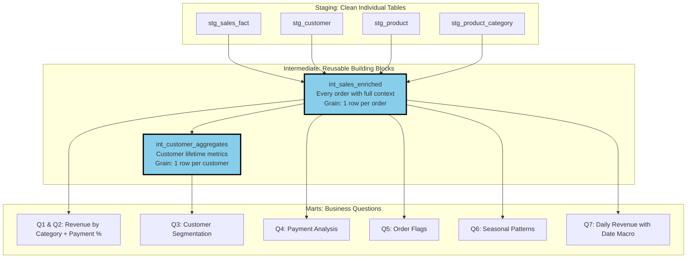

```mermaid
graph TB
    subgraph "Staging: Clean Individual Tables"
        A[stg_sales_fact]
        B[stg_customer]
        C[stg_product]
        D[stg_product_category]
    end
    
    subgraph "Intermediate: Reusable Building Blocks"
        E[int_sales_enriched<br/>Every order with full context<br/>Grain: 1 row per order]
        F[int_customer_aggregates<br/>Customer lifetime metrics<br/>Grain: 1 row per customer]
    end
    
    subgraph "Marts: Business Questions"
        G[Q1 & Q2: Revenue by Category + Payment %]
        H[Q3: Customer Segmentation]
        I[Q4: Payment Analysis]
        J[Q5: Order Flags]
        K[Q6: Seasonal Patterns]
        L[Q7: Daily Revenue with Date Macro]
    end
    
    A --> E
    B --> E
    C --> E
    D --> E
    
    E --> F
    
    E --> G
    F --> H
    E --> I
    E --> J
    E --> K
    E --> L
    
    style E fill:#87CEEB,stroke:#000,stroke-width:3px
    style F fill:#87CEEB,stroke:#000,stroke-width:3px
```