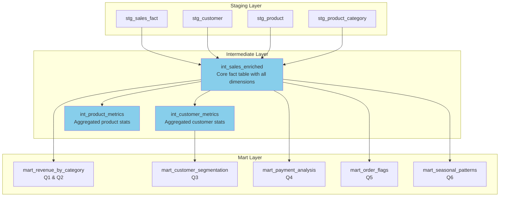

```mermaid
graph TB
    subgraph "Staging Layer"
        A[stg_sales_fact]
        B[stg_customer]
        C[stg_product]
        D[stg_product_category]
    end
    
    subgraph "Intermediate Layer"
        E[int_sales_enriched<br/>Core fact table with all dimensions]
        F[int_customer_metrics<br/>Aggregated customer stats]
        G[int_product_metrics<br/>Aggregated product stats]
    end
    
    subgraph "Mart Layer"
        H[mart_revenue_by_category<br/>Q1 & Q2]
        I[mart_customer_segmentation<br/>Q3]
        J[mart_payment_analysis<br/>Q4]
        K[mart_order_flags<br/>Q5]
        L[mart_seasonal_patterns<br/>Q6]
    end
    
    A --> E
    B --> E
    C --> E
    D --> E
    
    E --> F
    E --> G
    
    E --> H
    F --> I
    E --> J
    E --> K
    E --> L
    
    style E fill:#87CEEB
    style F fill:#87CEEB
    style G fill:#87CEEB
```