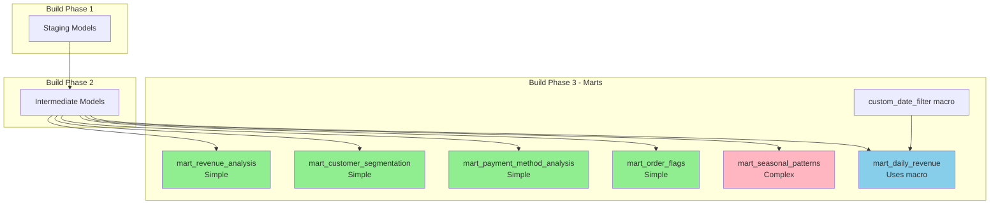

```mermaid
graph TB
    subgraph "Build Phase 1"
        A[Staging Models]
    end
    
    subgraph "Build Phase 2"
        B[Intermediate Models]
    end
    
    subgraph "Build Phase 3 - Marts"
        C[mart_revenue_analysis<br/>Simple]
        D[mart_customer_segmentation<br/>Simple]
        E[mart_payment_method_analysis<br/>Simple]
        F[mart_order_flags<br/>Simple]
        G[mart_seasonal_patterns<br/>Complex]
        H[custom_date_filter macro]
        I[mart_daily_revenue<br/>Uses macro]
    end
    
    A --> B
    B --> C
    B --> D
    B --> E
    B --> F
    B --> G
    H --> I
    B --> I
    
    style C fill:#90EE90
    style D fill:#90EE90
    style E fill:#90EE90
    style F fill:#90EE90
    style G fill:#FFB6C1
    style I fill:#87CEEB
```