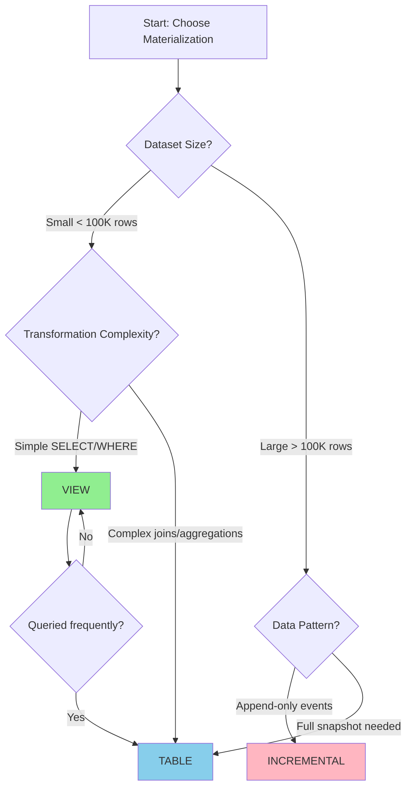

```mermaid
graph TD
    A[Start: Choose Materialization] --> B{Dataset Size?}
    B -->|Small < 100K rows| C{Transformation Complexity?}
    B -->|Large > 100K rows| D{Data Pattern?}

    C -->|Simple SELECT/WHERE| E[VIEW]
    C -->|Complex joins/aggregations| F[TABLE]

    D -->|Append-only events| G[INCREMENTAL]
    D -->|Full snapshot needed| F

    E --> H{Queried frequently?}
    H -->|Yes| F
    H -->|No| E

    style E fill:#90EE90
    style F fill:#87CEEB
    style G fill:#FFB6C1
```