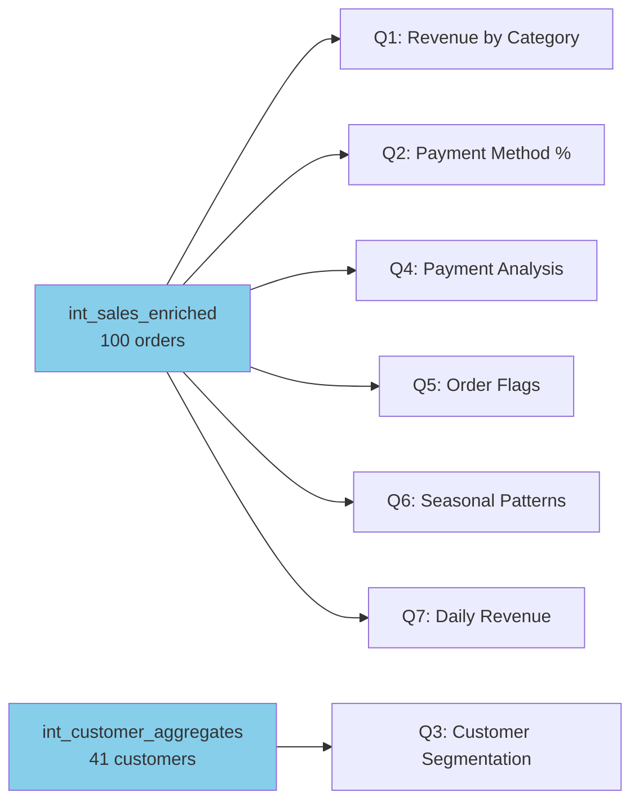

```mermaid
graph LR
    A[int_sales_enriched<br/>100 orders] --> B[Q1: Revenue by Category]
    A --> C[Q2: Payment Method %]
    A --> D[Q4: Payment Analysis]
    A --> E[Q5: Order Flags]
    A --> F[Q6: Seasonal Patterns]
    A --> G[Q7: Daily Revenue]
    
    H[int_customer_aggregates<br/>41 customers] --> I[Q3: Customer Segmentation]
    
    style A fill:#87CEEB
    style H fill:#87CEEB
```