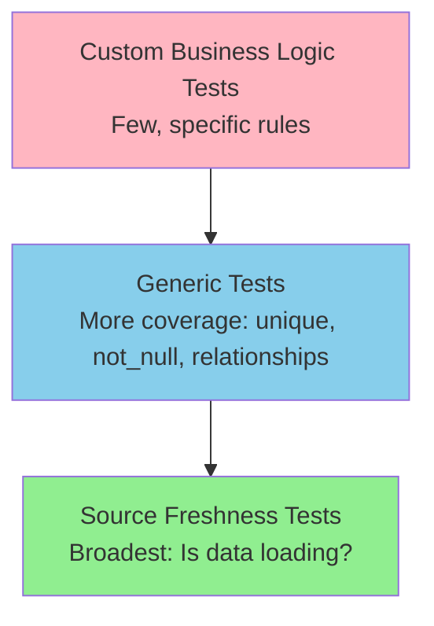

```mermaid
graph TB
    A[Custom Business Logic Tests<br/>Few, specific rules] --> B[Generic Tests<br/>More coverage: unique, not_null, relationships]
    B --> C[Source Freshness Tests<br/>Broadest: Is data loading?]
    
    style A fill:#FFB6C1
    style B fill:#87CEEB
    style C fill:#90EE90
```